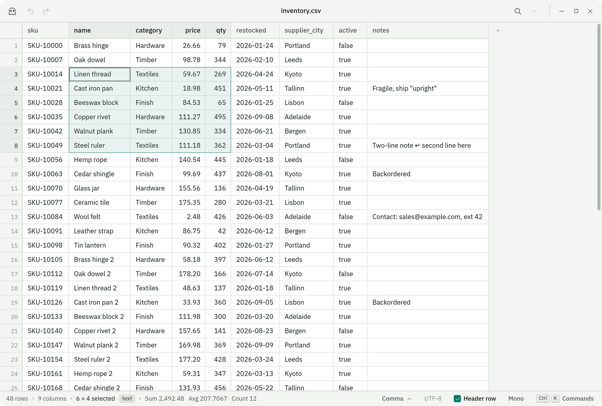
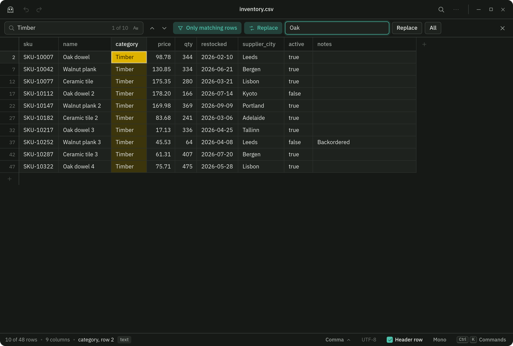
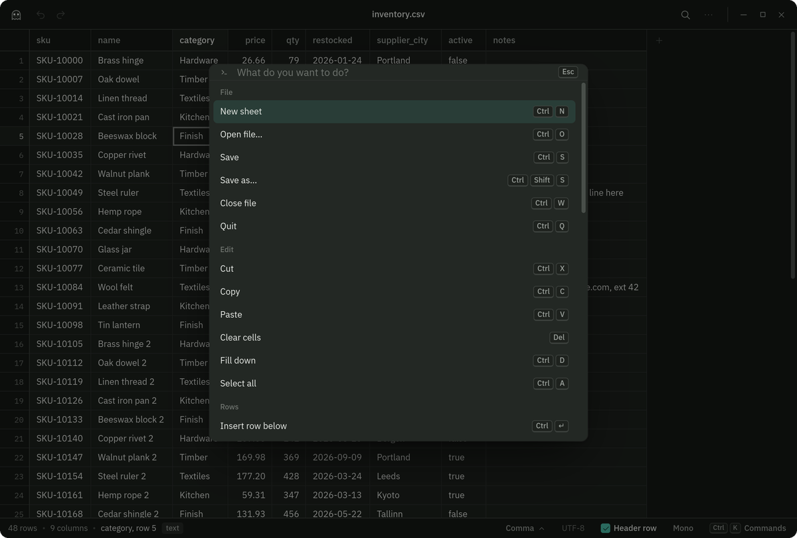
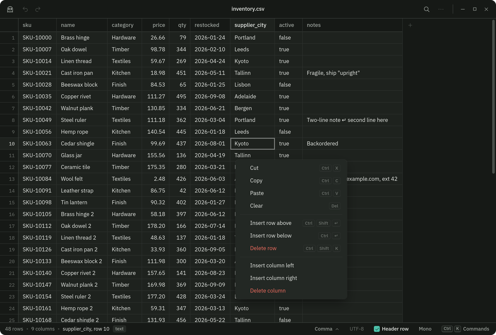

<p align="center">
  
</p>

<h1 align="center">bedsheet</h1>

<p align="center">
  A CSV editor for Linux that is fast, focused, and genuinely nice to look at.<br>
  Named for the ghost costume, and for what other spreadsheet apps do to you.
</p>

<p align="center">
  <picture>
    <source media="(prefers-color-scheme: dark)" srcset="docs/screenshot-dark.png">
    
  </picture>
</p>

## Why

Most CSV work is not spreadsheet work. You open the file, look at it, fix a few cells,
maybe sort it or find something, and save it. Spreadsheet apps make you wade through
formulas, formatting, charts, and ribbons to do that, and then they quietly mangle your
file on the way out.

bedsheet does the small job well. It opens delimited text instantly, gets out of your way,
and writes the file back the way it came in. It also looks like something you'd want to
keep open.

## What it does

**Reads anything delimited.** CSV, TSV, semicolons, pipes. The delimiter, line endings, and
encoding are detected on open (UTF-8 with or without BOM, UTF-16 with or without one, and a
Windows-1252 fallback). Files with short rows are padded and you're told about it.

**Stays fast.** The grid only renders what's on screen, in both directions. A 200,000-row,
14 MB file parses in about 200 ms and searches across 1.6 million cells in about 70 ms.
Scrolling stays smooth at any size.

**Edits the way you expect.** Start typing to replace a cell, press Enter or F2 to edit it,
Alt+Enter for a line break inside a cell. Tab and Enter commit and move. Every change is
undoable, including sorts and structural changes.

**Handles the whole sheet.** Range, row, column, and select-all selection. Copy, cut, and
paste blocks to and from other apps. Fill down. Insert and delete rows and columns. Rename
columns. Sort with type-aware comparison. Resize columns by dragging, or double-click the
edge to fit.

**Finds and replaces.** Matches are highlighted in the grid as you type. Step through them,
match case, replace one or all, or show only the rows that match and work on those.

**Knows what it's looking at.** Numeric columns are detected and right-aligned with tabular
figures. Select a block of numbers and the status bar shows sum, average, and count.
Multi-line cells show their line breaks inline.

**Has a command palette.** Ctrl+K lists every command with its shortcut. Right-click menus
cover the common cases. Ctrl+/ shows the full keyboard reference.

**Follows your desktop.** Light and dark themes track the system setting, or pin one.
Recent files, drag and drop to open, and `bedsheet file.csv` from the terminal.

<p align="center">
  
  
</p>

## Install

Grab the package for your distribution from the
[Releases](../../releases) page.

```sh
# Fedora, RHEL, openSUSE
sudo dnf install ./bedsheet-*.x86_64.rpm

# Debian, Ubuntu, Mint
sudo apt install ./bedsheet_*_amd64.deb

# Anything else
chmod +x bedsheet_*.AppImage && ./bedsheet_*.AppImage
```

The packages register bedsheet as a handler for `.csv` and `.tsv` files, so it shows up in
"Open with" in your file manager.

## Using it

```sh
bedsheet                    # start with the empty sheet
bedsheet export.csv         # open a file
```

### Keyboard

Everything is reachable from the keyboard. This is the full set; Ctrl+/ shows it inside the app.

| Moving around | |
| --- | --- |
| Move | Arrows |
| Extend selection | Shift+Arrows |
| Jump to the edge of the sheet | Ctrl+Arrows |
| Extend to the edge | Ctrl+Shift+Arrows |
| First or last column | Home, End |
| Top-left or bottom-right corner | Ctrl+Home, Ctrl+End |
| Page up or down | PgUp, PgDn |
| Select row, select column, select all | Shift+Space, Ctrl+Space, Ctrl+A |
| Go to row | Ctrl+G |

| Editing | |
| --- | --- |
| Replace a cell | Just start typing |
| Edit a cell | Enter or F2 |
| Line break inside a cell | Alt+Enter |
| Commit and move down or up | Enter, Shift+Enter |
| Commit and move right or left | Tab, Shift+Tab |
| Cancel | Esc |
| Clear cells | Delete or Backspace |
| Cut, copy, paste | Ctrl+X, Ctrl+C, Ctrl+V |
| Fill down | Ctrl+D |
| Undo, redo | Ctrl+Z, Ctrl+Shift+Z |

| Rows and columns | |
| --- | --- |
| Insert row below, insert row above | Ctrl+Enter, Ctrl+Shift+Enter |
| Delete selected rows | Ctrl+Shift+K |
| Insert or delete columns | Right-click a header, or Ctrl+K |
| Rename a column | Double-click its header |
| Resize a column, fit it to content | Drag the header edge, double-click it |
| Sort by a column | Right-click its header |
| Use the first row as the header | Header row toggle in the status bar |

| Finding | |
| --- | --- |
| Find | Ctrl+F |
| Find and replace | Ctrl+H |
| Next, previous match | Enter, Shift+Enter in the find box, or F3, Shift+F3 |
| Replace all | Ctrl+Enter in the replace box |

| Files and view | |
| --- | --- |
| Open, save, save as | Ctrl+O, Ctrl+S, Ctrl+Shift+S |
| New sheet, close file, quit | Ctrl+N, Ctrl+W, Ctrl+Q |
| Zoom in, out, reset | Ctrl+=, Ctrl+-, Ctrl+0 |
| Command palette | Ctrl+K |
| Keyboard reference | Ctrl+/ |

### Small things you'll notice

- Click a row number to select the row, a column header to select the column, the corner
  to select everything. Shift-click extends. Dragging past the edge scrolls.
- Paste a single value into a multi-cell selection and it fills every cell.
- Paste a block bigger than the sheet and the sheet grows to fit.
- With "only matching rows" on, row numbers stay the real row numbers from the file.
- The delimiter and encoding chips in the status bar switch how the file is read, or, once
  you've made edits, how it will be saved.
- The Mono chip switches cell text to a monospace face. Row numbers are always monospace.

<p align="center">
  
</p>

## Your file comes back the way it went in

This is the part spreadsheet apps get wrong, so it's the part bedsheet is strict about.

- **Values are never reformatted.** `007` stays `007`. `1,000` stays `1,000`. Dates stay
  whatever string they were. Alignment and number detection are display-only.
- **The delimiter is preserved.** A semicolon file saves as a semicolon file.
- **Line endings are preserved.** CRLF in, CRLF out, and a file with no line break after its
  last row doesn't gain one.
- **The encoding is preserved.** UTF-16 stays UTF-16, Windows-1252 stays Windows-1252, and a
  UTF-8 byte order mark is kept if the file had one. If you type a character the encoding
  can't hold, the file is saved as UTF-8 instead and you're told.
- **Quoting follows the file.** Fields containing the delimiter, quotes, line breaks, or
  leading and trailing spaces are always quoted, per RFC 4180. Beyond that, a file that quotes
  every field, or every text field, is written back the same way, and a file that doesn't
  gets no extra quotes.
- **Other programs' changes aren't trampled.** If the file changes on disk while it's open,
  bedsheet offers to reload it, and asks before saving over it.
- **Writes are atomic.** The file is written to a temporary sibling and renamed into place,
  so a crash mid-save can't leave you with half a file.

One thing does change, and you're told on open when it does: rows shorter than the widest
row are padded with empty cells.

## Design

The grid is the product, so everything else is built to recede.

The reference is ledger paper. The surface is a faintly green-tinted paper tone, cells sit on
hairline rules, and row numbers are set in a monospace face like a printed ledger. The
empty screen is ruled paper with a red margin line, and recent files sit on the lines like
entries.

The active cell is outlined in ink black rather than the usual blue, so it reads instantly
against any data. Range selection is a soft wash of the single accent color, a verdigris
that is used sparingly elsewhere for focus and toggles. Search matches are highlighter
yellow, with the current match brighter.

Type is IBM Plex Sans for the interface and for cell text, with tabular figures so numbers
line up, and IBM Plex Mono for row numbers and the optional monospace cell mode. Both are
bundled, so the app looks the same on every machine.

The window draws its own title bar and corners, so there's no stock toolbar or chrome
between you and the sheet. Both themes are designed, not derived; the dark one is a deep
green-charcoal rather than gray.

## Under the hood

- [Tauri 2](https://tauri.app) provides the window and file access. The Rust side is small:
  it reads and writes bytes and hands the window over. File contents cross the boundary as
  raw bytes, not JSON, so large files open without a serialization detour.
- The interface is [Svelte 5](https://svelte.dev) and TypeScript.
- The CSV parser is a hand-written RFC 4180 state machine with tests covering quoting,
  escaped quotes, embedded line breaks, mixed line endings, BOMs, ragged rows, and
  unterminated quotes.
- The grid is virtualized on both axes and positions cells absolutely, so a million rows
  cost the same to render as forty. Sheets taller than a browser can lay out (a little over a
  million rows) keep their own scroll offset, so the last row is as reachable as the first.
- Undo is a command stack. Every operation records how to reverse itself, including sorts,
  which store their permutation.
- The release binary is about 4.6 MB. It uses the system WebKitGTK.

## Not planned

bedsheet opens delimited text. It will not become a spreadsheet. Formulas, charts, pivot
tables, multiple sheets, cell formatting, cloud sync, and plugins are out of scope.

Things that might land: column drag-to-reorder, freezing the first column, a wrap-text row
mode, and reading `.xlsx` files (as import only).

## Building from source

You need Rust (stable), Node 20 or newer, pnpm, and the WebKitGTK development libraries.

```sh
# Fedora
sudo dnf install webkit2gtk4.1-devel gtk3-devel librsvg2-devel

# Debian and Ubuntu
sudo apt install libwebkit2gtk-4.1-dev build-essential libssl-dev librsvg2-dev

# Arch
sudo pacman -S webkit2gtk-4.1 base-devel librsvg
```

```sh
pnpm install
pnpm tauri dev              # run with hot reload
pnpm tauri build            # .deb, .rpm, and AppImage in src-tauri/target/release/bundle
pnpm test                   # parser tests
pnpm check                  # type check
```

`pnpm dev` runs the interface alone in a browser, with file access falling back to the
browser's picker and downloads. That's handy for working on the grid.

On distributions with recent binutils, linuxdeploy's bundled `strip` can't read the system
libraries it copies into the AppImage. If the AppImage step fails, build with
`NO_STRIP=true pnpm tauri build`. The .deb and .rpm are unaffected.

bedsheet is built and tested on Fedora with GNOME on Wayland. It should run on any Linux
desktop with WebKitGTK 4.1.

## License

[MIT](LICENSE)
